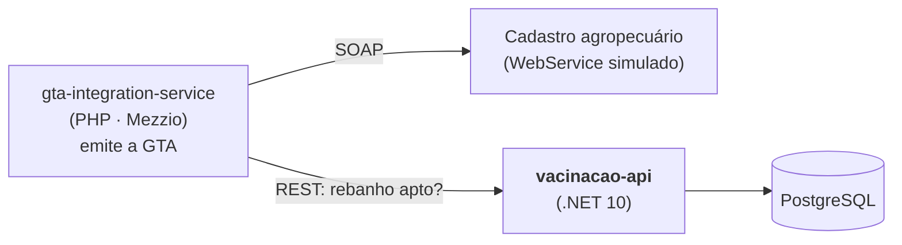

# vacinacao-api

[](https://github.com/wescaxeta/vacinacao-api/actions/workflows/ci.yml)


[](LICENSE)

API de **controle de vacinação de rebanhos**. Registra as campanhas obrigatórias definidas pela
defesa agropecuária e as vacinações aplicadas em cada propriedade, e responde se o rebanho está
**apto para transporte**, ou seja, se pode receber uma GTA (Guia de Trânsito Animal).

Faz parte de um pequeno ecossistema de sistemas de defesa agropecuária que montei em linguagens
diferentes, baseado na minha experiência com sistemas usados em 9 estados. Todo o código e todos
os dados são fictícios.

O [gta-integration-service](https://github.com/wescaxeta/gta-integration-service) (PHP) **consome esta
API antes de emitir cada GTA**: se o rebanho não está apto, a guia é recusada com o motivo vindo daqui.
O Docker Compose daquele projeto sobe esta API direto deste repositório.



## A regra de aptidão

Para cada doença com campanha **obrigatória** para a espécie:

| Situação da propriedade | Resultado |
|---|---|
| Tem vacinação válida (data de aplicação + validade da campanha ≥ hoje) | ✅ coberta |
| Não tem, e o prazo de alguma campanha da doença **já terminou** | ❌ **pendência**, transporte bloqueado |
| Não tem, mas a campanha ainda **está em andamento** | ⚠️ aviso, o produtor ainda está no prazo |

A propriedade está **apta** quando não há nenhuma pendência. A regra fica isolada em
[`AvaliadorAptidao`](src/Vacinacao.Domain/AvaliadorAptidao.cs), uma função pura testada sem banco nem HTTP.

```json
GET /propriedades/GO000003/aptidao?especie=bovino

{
  "codigoPropriedade": "GO000003",
  "especie": "bovino",
  "apta": false,
  "coberturas": [],
  "pendencias": ["Sem vacinação válida contra Brucelose: o prazo da campanha \"Brucelose - etapa anterior\" terminou em 02/09/2026."],
  "avisos": ["Campanha \"Raiva dos herbívoros - etapa atual\" em andamento: vacine contra Raiva até 16/11/2026."]
}
```

## Destaques técnicos

| O quê | Onde |
|---|---|
| **Arquitetura em camadas** (Domain → Application → Infrastructure → Api), com dependências apontando para o domínio | [`src/`](src) |
| **Domínio rico**: entidades com construtor privado, invariantes no próprio modelo e *value object* `CodigoPropriedade` | [`Campanha`](src/Vacinacao.Domain/Campanha.cs) |
| **Minimal APIs** com grupos de rotas, `TypedResults` e documentação **OpenAPI** nativa do .NET 10 + interface **Scalar** | [`Endpoints/`](src/Vacinacao.Api/Endpoints) |
| **FluentValidation** via *endpoint filter*: 400 com erros por campo; regras de negócio viram 422 | [`FiltroDeValidacao`](src/Vacinacao.Api/FiltroDeValidacao.cs) |
| **Problem Details (RFC 9457)** com `IExceptionHandler` | [`TratadorDeExcecoes`](src/Vacinacao.Api/TratadorDeExcecoes.cs) |
| **EF Core 10 + PostgreSQL**: migrations, nomes em snake_case, check constraints, índices e *value converter* | [`VacinacaoDbContext`](src/Vacinacao.Infrastructure/VacinacaoDbContext.cs) |
| **Tempo testável**: `TimeProvider` injetado e data calculada no fuso de Brasília | [`RelogioExtensions`](src/Vacinacao.Application/Abstracoes.cs) |
| **Testes de integração com PostgreSQL real** via `WebApplicationFactory` + **Testcontainers** | [`ApiFactory`](tests/Vacinacao.IntegrationTests/ApiFactory.cs) |
| **Qualidade no build**: warnings como erro, `.editorconfig` aplicado e `dotnet format` no CI | [`Directory.Build.props`](Directory.Build.props) |
| **Docker** multi-stage, rodando com usuário sem privilégios | [`Dockerfile`](Dockerfile) |

## Como rodar

Requisito: Docker.

```bash
git clone https://github.com/wescaxeta/vacinacao-api.git
cd vacinacao-api
docker compose up --build
```

- Documentação interativa: **http://localhost:8090/scalar/v1**
- Exemplos de requisição: [`requests.http`](requests.http)
- Smoke test: `sh tests/smoke.sh`

O ambiente sobe com **dados de demonstração**, gerados com datas relativas a hoje:

| Propriedade | Situação | Aptidão (bovinos) |
|---|---|---|
| `GO000001` | Vacinou contra brucelose e raiva | ✅ apta |
| `GO000003` | Não vacinou contra brucelose (prazo encerrado) | ❌ bloqueada |
| `MT000010` | Vacinou contra brucelose; raiva ainda no prazo | ✅ apta, com aviso |

## Endpoints

| Método | Rota | Descrição |
|---|---|---|
| `POST` | `/campanhas` | Cria uma campanha de vacinação |
| `GET` | `/campanhas?especie=` | Lista campanhas |
| `GET` | `/campanhas/{id}` | Consulta uma campanha |
| `POST` | `/campanhas/{id}/vacinacoes` | Registra a vacinação de uma propriedade |
| `GET` | `/propriedades/{codigo}/vacinacoes` | Histórico de vacinações |
| `GET` | `/propriedades/{codigo}/aptidao?especie=` | **Rebanho apto para transporte?** |
| `GET` | `/health` | Health check (inclui o banco) |

## Testes

```bash
dotnet test   # os testes de integração precisam de Docker (Testcontainers)
```

- **Unitários (29):** regras do domínio, cálculo de aptidão, validadores e serviços com `FakeTimeProvider`
- **Integração (9):** a API inteira contra PostgreSQL real: fluxo completo, 400, 404, 422 e OpenAPI

Sem Docker, aponte para um PostgreSQL existente com `TEST_CONNECTION_STRING`.

## Decisões

- [ADR 0001: arquitetura em camadas sem MediatR](docs/adr/0001-camadas-sem-mediatr.md)

## Roadmap

- [x] `gta-integration-service` consultar esta API antes de emitir a GTA
- [ ] Autenticação JWT por perfil (veterinário registra, fiscal consulta)
- [ ] Cobertura vacinal mínima (% do rebanho), cruzando com o saldo do cadastro agropecuário
- [ ] Outbox para publicar o evento "vacinação registrada"

## Licença

[MIT](LICENSE)
